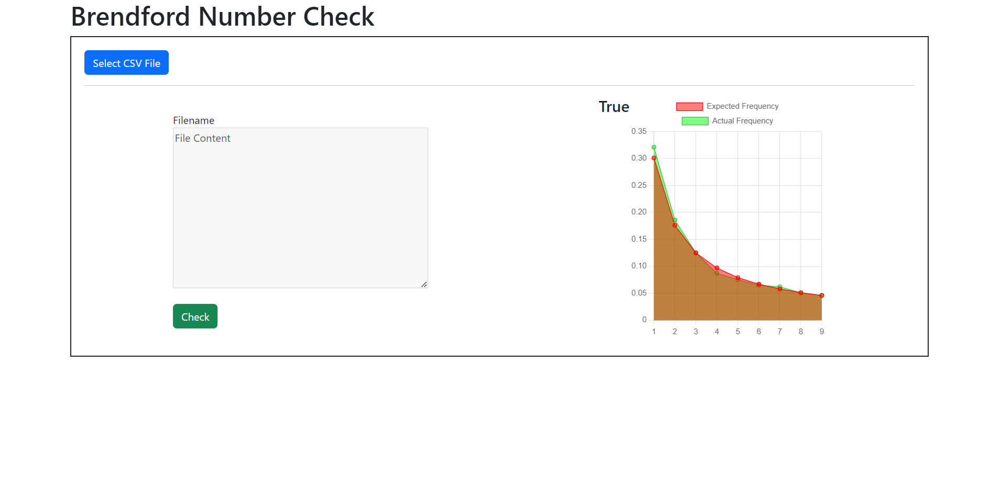
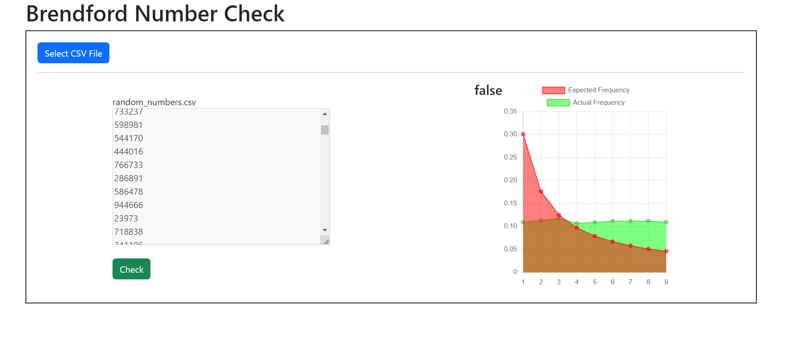

# Benford's Law Check

This is a simple web application that checks if a given CSV file follows [Benford's Law](https://en.wikipedia.org/wiki/Benford%27s_law).

## Requirements
- Python 3.x
- Pyramid
- WebOb

## Installation
1. Clone the repository to your local machine.
2. Install the required packages using pip: `pip install -r requirements.txt`
3. Run the server: `python main.py`
4. Access the web service by navigating to `http://localhost:8000` in your web browser.

## Usage
1. Select the `Benford` option from the navigation menu.
2. Choose a CSV file to upload that contains the set of numbers you want to check.
3. Click the `Check` button to perform the Benford's law check.

## How it works
1. The user uploads a CSV file containing the set of numbers they want to check.
2. The server reads the CSV file and extracts the set of numbers.
3. The server then calculates the frequency of each first digit in the set of numbers.
4. The server compares the calculated frequencies to the expected frequencies based on Benford's law.
5. If the calculated frequencies are within 2% of the expected frequencies for all digits, the set of numbers satisfies Benford's law.
6. The server returns a JSON response indicating whether the set of numbers satisfies Benford's law and the calculated and expected frequencies.

## Screenshots

## License
This project is licensed under the MIT License. See the `LICENSE` file for details.

